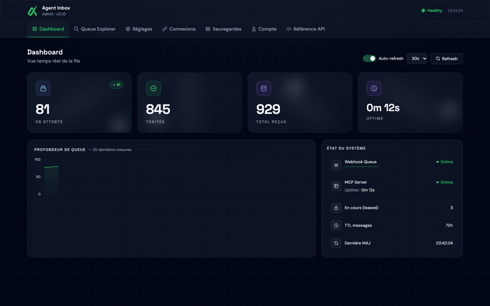
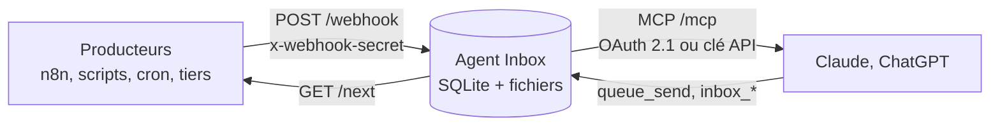
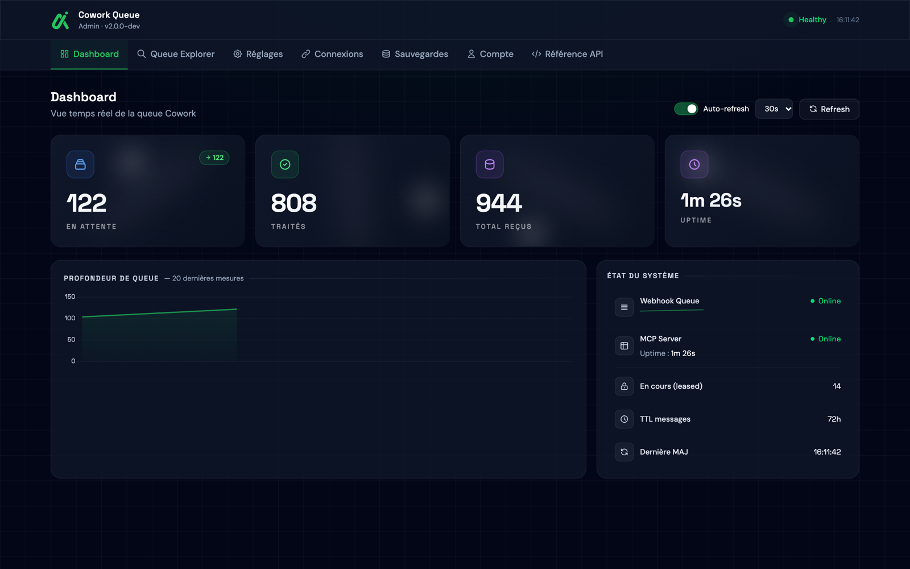
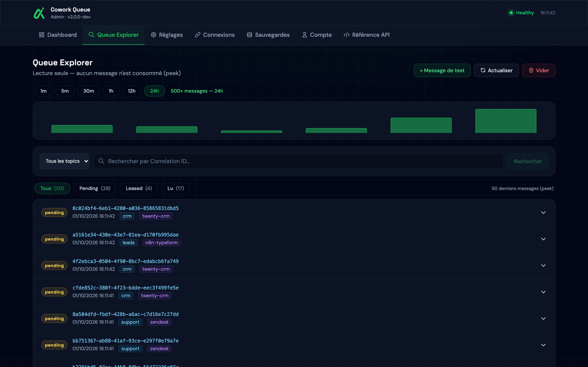
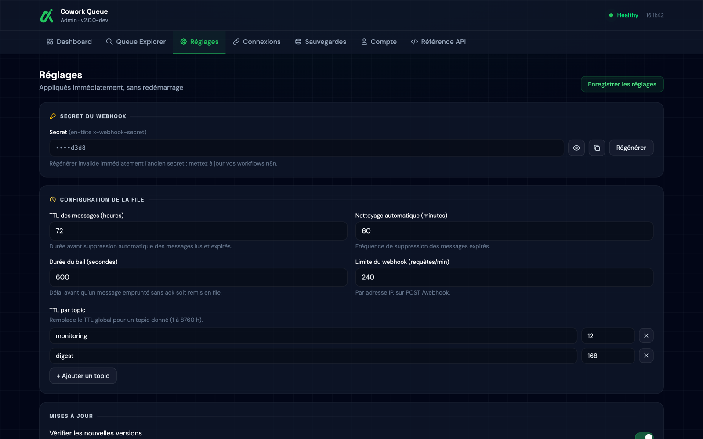
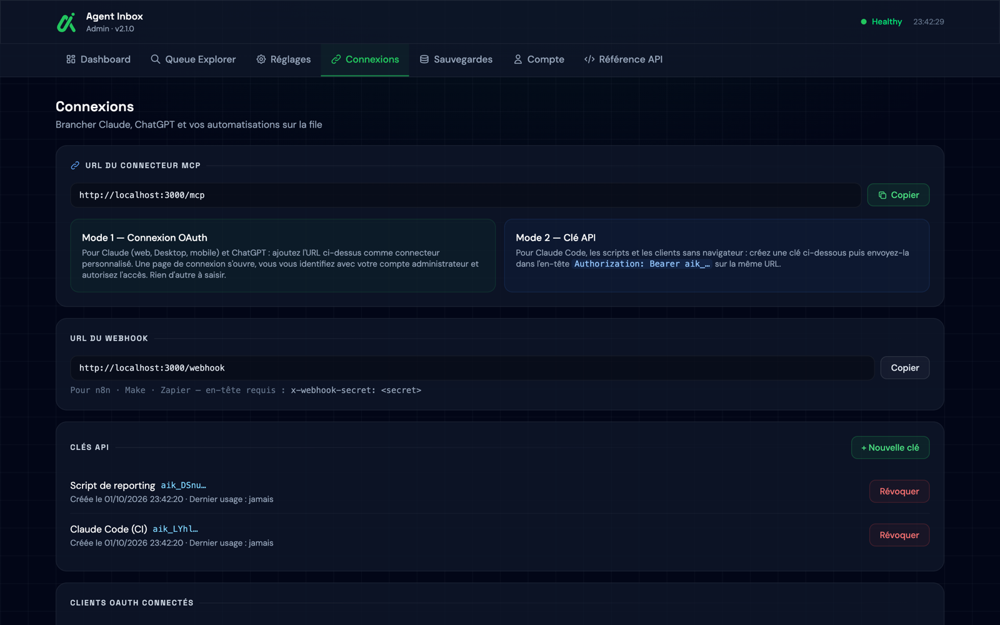
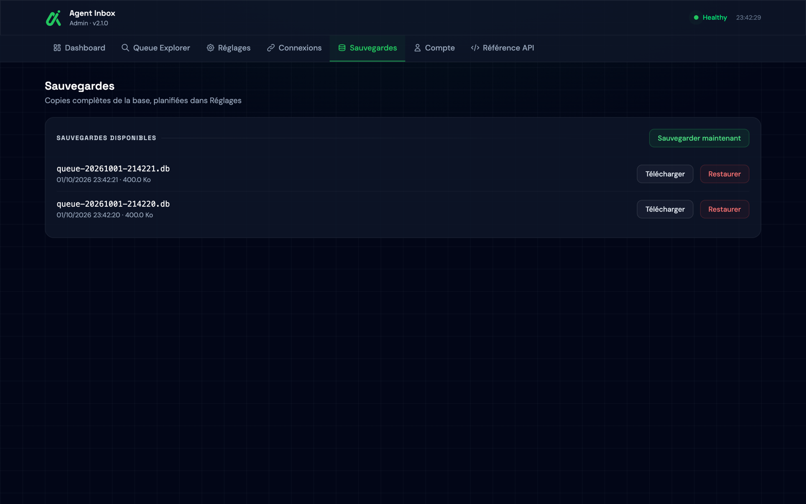
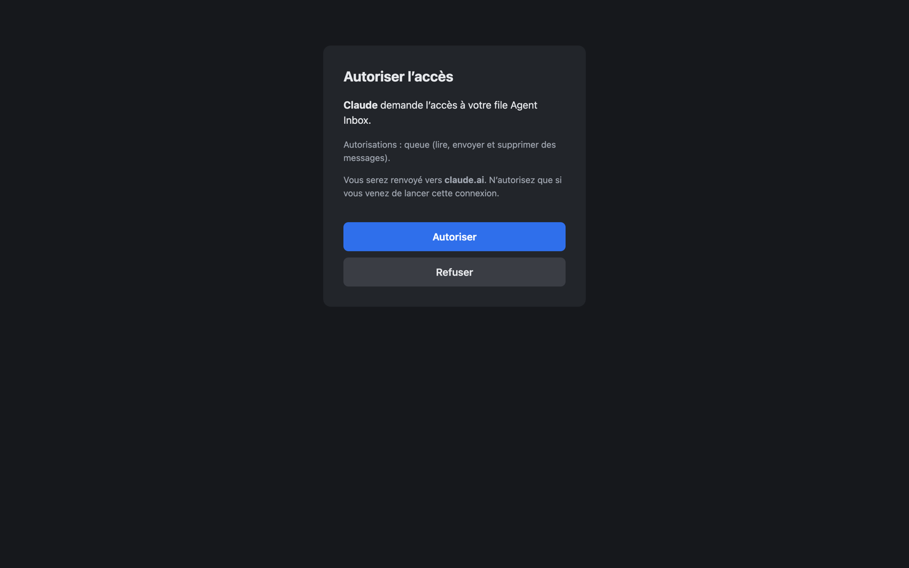

# Agent Inbox

[](https://github.com/KlevisGolemi/agent-inbox/actions/workflows/ci.yml)
[](https://github.com/KlevisGolemi/agent-inbox/releases)
[](LICENSE)
[](package.json)

**Votre IA ne voit que ce qu'on lui donne. Agent Inbox lui donne les événements, les fichiers et les contextes de vos outils.**

Une file d'attente auto-hébergée : vos automatisations (n8n, scripts, outils sans MCP) y déposent des
événements et des fichiers, Claude et ChatGPT les lisent via MCP, et leur répondent par la même voie.
Un conteneur, une base SQLite, vingt outils MCP, une interface d'administration.



## Le problème

n8n sait que la facture F-2026-1042 est en retard. Claude, lui, n'en sait rien.

Votre CRM, votre support, votre monitoring ne parlent pas MCP : ce qu'ils savent, c'est appeler une URL.
Leurs événements n'arrivent donc jamais jusqu'à votre assistant. Une file entre les deux règle cela :
une URL pour déposer, un connecteur pour lire.

## Comment ça marche

Pensez à une **boîte aux lettres** entre vos automatisations et votre IA.



| Geste                 | Ce qui se passe                                                      | Côté technique                                  |
| --------------------- | -------------------------------------------------------------------- | ----------------------------------------------- |
| **Déposer**           | Un outil poste un événement, avec un secret en en-tête               | `POST /webhook`                                 |
| **Relever**           | Claude prend le plus ancien message en attente                       | `queue_next` : le message est _emprunté_ (bail) |
| **Accuser réception** | Claude confirme qu'il a traité le message ; sinon il revient en file | `queue_ack` / `queue_nack`                      |

L'assistant peut aussi écrire dans la boîte (`queue_send`) : n8n relève sa demande, puis la réponse revient
par `correlation_id`.

### Trois façons d'envoyer un fichier

Agent Inbox 2.2 transforme la file en **boîte aux lettres pour LLM** : chaque message peut porter des
fichiers, des tags et même venir d'un tiers qui n'a pas de compte.

1. **Un gros zip depuis Codex.** `inbox_upload_link` crée un lien à usage unique, `curl -F file=@projet.zip <url>`
   l'envoie, puis Claude Code relève le message et télécharge l'archive par un lien signé.
2. **Une photo déposée par un tiers.** `inbox_create_drop` génère une URL publique montrée une seule fois ; le tiers
   glisse-dépose sa photo, et Claude Desktop ou ChatGPT la reçoit inline, marquée « externe non vérifié ».
3. **Un PDF depuis n8n.** Un nœud HTTP Request poste le fichier en `multipart/form-data` sur `/webhook` avec
   `x-tags: facture` ; l'agent le récupère, tagué et prêt à être traité.

Les fichiers sont détectés par signature binaire, classés par catégorie (image, audio, vidéo, document,
archive, other) et stockés sur le disque de l'instance. Un réglage de quota et une jauge de stockage
protègent l'espace disque.

## Essayer en 2 minutes

Prérequis : un serveur Linux avec Docker (Compose v2) et les ports 80 et 443 ouverts. Sans nom de domaine,
une adresse `sslip.io` est générée. HTTPS est obligatoire : Claude et ChatGPT refusent un connecteur en HTTP.

```bash
git clone https://github.com/KlevisGolemi/agent-inbox.git
cd agent-inbox
./install.sh
```

Ensuite : créez le compte administrateur sur `https://<votre-hôte>/setup`, puis ajoutez
`https://<votre-hôte>/mcp` comme connecteur personnalisé dans Claude
([détails pour Claude, ChatGPT et les clés API](docs/connecter-un-client.md)).

Pour simplement regarder, en local, sans Docker :

```bash
npm ci && npm run dev:ui   # http://localhost:3000/admin
```

## Ce que Claude peut faire

Vingt outils, tous sur `POST /mcp`. Un message lu par `queue_next`, `queue_wait` ou `queue_by_id(peek: false)`
est **emprunté** (statut `leased`) : acquittez-le avec `queue_ack`, sinon il est servi à nouveau après
`lease_timeout_sec` (300 s par défaut).

| Outil               | Rôle                                                                                           | Paramètres                                                                 |
| ------------------- | ---------------------------------------------------------------------------------------------- | -------------------------------------------------------------------------- |
| `queue_status`      | Vérifie que le serveur répond (`uptime_s`, `version`, `storage`)                               | —                                                                          |
| `queue_stats`       | Compte les messages (`total`, `pending`, `leased`, `read_count`) et leur répartition par topic | `topic`                                                                    |
| `queue_peek`        | Liste les messages, du plus récent au plus ancien, sans les consommer                          | `limit` (1–100, 50), `offset`, `topic`                                     |
| `queue_search`      | Cherche par topic, source, statut, période, texte, tag ou pièce jointe, sans consommer         | `topic`, `source`, `status`, `since`, `until`, `text`, `tag`, `has_attachments`, `limit` (1–100, 50) |
| `queue_by_id`       | Lit le message d'un `correlation_id` ; `peek: false` l'emprunte                                | `correlation_id`, `peek` (défaut `true`)                                   |
| `queue_next`        | Emprunte le plus ancien message en attente                                                     | `topic`                                                                    |
| `queue_wait`        | Attend un message (attente longue) puis l'emprunte                                             | `topic` ou `correlation_id`, `timeout_sec` (1–50, 30)                      |
| `queue_ack`         | Confirme qu'un message emprunté est traité (statut `read`)                                     | `lease_id`                                                                 |
| `queue_nack`        | Remet un message emprunté en file (statut `pending`)                                           | `lease_id`                                                                 |
| `queue_send`        | Dépose un message (réponse ou tâche pour n8n), éventuellement avec fichiers et tags            | `payload`, `correlation_id`, `source` (`claude`), `topic`, `attachments`, `tags`, `new_tags` |
| `queue_tag`         | Pose ou retire des tags sur un message existant                                                | `message_id`, `add`, `remove`, `new_tags`                                  |
| `queue_delete`      | Supprime un message (irréversible)                                                             | `id` (UUID)                                                                |
| `queue_clear`       | Vide toute la file (irréversible) ; renvoie `{ ok, deleted }` (nombre de messages supprimés)   | `confirm: true`                                                            |
| `inbox_tags`        | Liste le registre de tags partagés                                                             | `query`, `limit`                                                           |
| `inbox_create_tag`  | Crée un tag dans le registre (anti-doublon)                                                    | `name`, `description`, `force`                                             |
| `inbox_get_file`    | Récupère une pièce jointe : inline, lien signé ou `curl`                                       | `attachment_id`, `delivery` (`auto`, `inline`, `link`)                     |
| `inbox_upload_link` | Crée un lien d'upload à usage unique pour un gros fichier                                      | `topic`, `tags`, `correlation_id`, `payload`, `on_download`                |
| `inbox_create_drop` | Crée un lien de dépôt public pour un tiers                                                     | `label`, `topic`, `tags`, `expires_in_hours`, `max_files`, `max_file_mb`, `allowed_categories` |
| `inbox_drops`       | Liste les liens de dépôt existants                                                             | `include_expired`                                                          |
| `inbox_revoke_drop` | Révoque immédiatement un lien de dépôt                                                         | `drop_id`                                                                  |

Les clients **avec shell** (Claude Code, Codex) téléchargent les gros fichiers par lien signé (`inbox_get_file`
avec `delivery: link`). Les clients **sans shell** (Claude Desktop/Web, ChatGPT) reçoivent les images et
les sons en inline jusqu'à `inline_max_mb` ; au-delà, l'outil renvoie un lien à ouvrir par l'humain.

Ce que vous écrivez à Claude, tout simplement :

> « Qu'est-ce qui est arrivé dans la file depuis ce matin ? »

> « Prends les alertes du topic `monitoring`, résume-les, puis confirme-les. »

> « Cherche les messages qui mentionnent la facture F-2026-1042 et prépare une relance. »

## Vos données restent chez vous

Un événement isolé est anodin. Mis bout à bout, des événements de CRM, de facturation ou de monitoring
racontent votre activité : clients, chiffre d'affaires, incidents. Voici ce qui est protégé, comment, et
combien de temps.

- **Où.** Les payloads restent dans la base SQLite de _votre_ serveur. Les fichiers sont stockés sur le
  disque de l'instance (`/data/files`). Aucun service tiers ne les reçoit.
- **Comment.** Connexion MCP en OAuth 2.1 avec PKCE, ou clé API `aik_…` dont seul le hash SHA-256 est stocké.
  L'administration est derrière une session avec protection CSRF. Les logs ne reçoivent ni secret, ni jeton,
  ni contenu de message, ni nom de fichier.
- **Combien de temps.** Durée de conservation (TTL) réglable globalement et **par topic** : par exemple
  12 h pour le monitoring et 168 h pour un digest. Les fichiers ont leur propre rétention par catégorie :
  la durée de vie effective d'un message devient `max(TTL du topic, rétention de ses pièces)`. Nettoyage
  automatique, sauvegardes avec rétention configurable (7 par défaut).
- **Sauvegardes.** Les sauvegardes de l'interface contiennent la base, pas les fichiers. Pensez à sauvegarder
  le volume complet (`/data`) si vous voulez conserver les pièces jointes. Après une restauration, le secret
  de signature des liens est régénéré : les anciens liens signés ne fonctionnent plus.
- **Ce qui sort.** Uniquement ce que l'assistant lit explicitement via un outil MCP (`queue_peek`,
  `queue_next`, `queue_search`…). Seule autre requête sortante : la vérification des nouvelles versions
  auprès de GitHub, désactivable dans Réglages.

Détails et signalement d'une faille : [SECURITY.md](SECURITY.md).

## En images

<table>
  <tr>
    <td width="50%"><br><sub>Le tableau de bord : état de la file d'un coup d'œil.</sub></td>
    <td width="50%"><br><sub>Queue Explorer : lecture seule, filtres par topic et statut, aucun message consommé.</sub></td>
  </tr>
  <tr>
    <td><br><sub>Réglages appliqués sans redémarrage : secret du webhook, bail, TTL par topic.</sub></td>
    <td><br><sub>Connexions : URL MCP, URL du webhook et clés API révocables.</sub></td>
  </tr>
  <tr>
    <td><br><sub>Sauvegardes de la base : télécharger ou restaurer en un clic.</sub></td>
    <td><br><sub>Consentement OAuth : vous autorisez chaque client, et seulement lui.</sub></td>
  </tr>
</table>

## Pour les développeurs

- **MCP sans état** : un serveur et un transport par `POST /mcp`, aucune session en mémoire ; un redémarrage
  du conteneur ne casse pas les connecteurs.
- **Prise atomique** : un seul `UPDATE … RETURNING` pour prendre un message, jamais `SELECT` puis `UPDATE`.
- **Bail et acquittement** : consommer emprunte le message ; sans `ack`, il revient après le délai du bail.
- **Réglages en base, relus à chaud** : modifiés dans l'admin, appliqués sans redémarrage.
- **OAuth 2.1** via le SDK MCP, ou clé API pour les clients sans navigateur.
- **Suite de tests Vitest** (+ Supertest), ESLint et `tsc` exécutés par la
  [CI](https://github.com/KlevisGolemi/agent-inbox/actions/workflows/ci.yml) : `npm run check`.

Stack : Node 24, TypeScript, Express 5, better-sqlite3. Plan du code et invariants :
[CLAUDE.md](CLAUDE.md) et [AGENTS.md](AGENTS.md) ; API HTTP des producteurs : [docs/api.md](docs/api.md).

**Positionnement.** Ce n'est pas Kafka ni RabbitMQ : une seule instance, pas de cluster, pas de débit
industriel. En revanche, un seul conteneur, une base SQLite, et votre IA branchée en deux minutes.

## Templates n8n

Quatre workflows prêts à importer, avec des nœuds standard : un événement vers Claude, un worker
requête/réponse, un digest quotidien et l'envoi d'un fichier en `multipart/form-data`. Voir
[examples/n8n/](examples/n8n/README.md).

## Documentation

| Document                                                   | Contenu                                                                                 |
| ---------------------------------------------------------- | --------------------------------------------------------------------------------------- |
| [docs/installation.md](docs/installation.md)               | Domaine, sslip.io, Traefik, mise à jour, sauvegardes, migration depuis la v1, dépannage |
| [docs/connecter-un-client.md](docs/connecter-un-client.md) | Claude (Web, Desktop, Code), ChatGPT, clés API                                  |
| [docs/api.md](docs/api.md)                                 | API HTTP des producteurs : routes, topics, `ack`, `wait`, `search`, exemples            |
| [docs/cas-d-usage.md](docs/cas-d-usage.md)                 | Trois recettes complètes avec n8n et Claude                                             |
| [AGENTS.md](AGENTS.md)                                     | Procédure d'installation pour un agent IA, guide pour contribuer au code                |
| [SECURITY.md](SECURITY.md) · [CHANGELOG.md](CHANGELOG.md)  | Sécurité, historique                                                                    |

## Contribuer

Les issues et pull requests sont bienvenues. Lancez `npm run check` avant chaque commit ; le guide est dans
[CONTRIBUTING.md](CONTRIBUTING.md).

## Licence

[MIT](LICENSE) © 2026 Klevis Golemi

## Premier pas

Une fois installé, envoyez votre premier événement (le secret se copie dans Admin → Réglages) :

```bash
curl -X POST https://<votre-hôte>/webhook \
  -H "x-webhook-secret: <secret>" -H "x-topic: events" -H "Content-Type: application/json" \
  -d '{"event":"hello"}'
```

Puis demandez à Claude : « Qu'est-ce qui est arrivé dans la file ? » Il appelle `queue_next` et vous
répond avec le message.

Si Agent Inbox vous a fait gagner du temps, une étoile sur GitHub aide d'autres personnes à le trouver.
Et si vous hésitez sur la suite, ouvrez une issue : « quel conseil pour la suite ? » est une vraie question.
