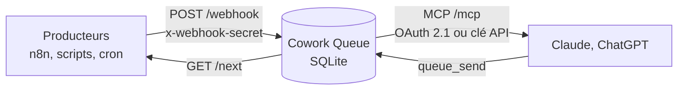

# Cowork Queue

[](https://github.com/KlevisGolemi/cowork-communication/actions/workflows/ci.yml)
[](https://github.com/KlevisGolemi/cowork-communication/releases)
[](LICENSE)

File d'attente auto-hébergée : vos automatisations (n8n, scripts, outils sans MCP) y déposent des
événements, Claude et ChatGPT les lisent via MCP, et leur répondent par la même voie.




## Pourquoi

- **Outils sans MCP.** Un workflow n8n, un cron ou une application SaaS ne parlent pas MCP : ils savent
  en revanche appeler une URL. La file fait le pont.
- **Événements asynchrones.** L'assistant n'est pas toujours là quand l'événement arrive. La file le garde
  (48 h par défaut) jusqu'à ce que quelqu'un le traite.
- **Dans les deux sens.** L'assistant peut aussi déposer une demande (`queue_send`) que n8n récupère,
  puis attendre la réponse par `correlation_id`.
- **Fiable.** Prise de message atomique, bail avec acquittement (`ack`), serveur MCP sans état :
  un redémarrage du conteneur ne casse pas les connecteurs.

## Démarrage en 5 minutes

Prérequis : un serveur Linux avec Docker (Compose v2), les ports 80 et 443 ouverts, et soit un nom de domaine
pointant vers le serveur, soit rien (une adresse `sslip.io` est alors générée). HTTPS est obligatoire :
Claude et ChatGPT refusent un connecteur en HTTP.

```bash
git clone https://github.com/KlevisGolemi/cowork-communication.git
cd cowork-communication
./install.sh
```

1. **Créer le compte administrateur.** Ouvrez `https://<votre-hôte>/setup` et saisissez le code affiché par
   `docker compose logs app | grep -i setup` (ou renseignez l'e-mail et le mot de passe quand `install.sh` les demande).
2. **Connecter un client.** Dans Claude : Paramètres → Connecteurs → Ajouter un connecteur personnalisé,
   URL `https://<votre-hôte>/mcp`. Détails pour Claude Code, ChatGPT et les autres clients :
   [docs/connecter-un-client.md](docs/connecter-un-client.md).
3. **Envoyer un premier événement.** Copiez le secret du webhook depuis Admin → Réglages, puis :

   ```bash
   curl -X POST https://<votre-hôte>/webhook \
     -H "x-webhook-secret: <secret>" -H "x-topic: events" -H "Content-Type: application/json" \
     -d '{"event":"hello"}'
   ```

   Demandez ensuite à Claude de lister la file : il appelle `queue_next` et reçoit le message.

Pour développer en local : `npm ci && npm run dev:ui` (voir [CONTRIBUTING.md](CONTRIBUTING.md)).

## Outils MCP

Douze outils, tous sur `POST /mcp`. Un message lu par `queue_next`, `queue_wait` ou `queue_by_id(peek: false)`
est **emprunté** (statut `leased`) : acquittez-le avec `queue_ack`, sinon il est servi à nouveau après
`lease_timeout_sec` (300 s par défaut).

| Outil | Rôle | Paramètres |
|---|---|---|
| `queue_status` | Vérifie que le serveur répond (`uptime_s`, `version`) | — |
| `queue_stats` | Compte les messages (`total`, `pending`, `leased`, `read_count`) et leur répartition par topic | `topic` |
| `queue_peek` | Liste les messages, du plus récent au plus ancien, sans les consommer | `limit` (1–500, 50), `offset`, `topic` |
| `queue_search` | Cherche par topic, source, statut, période ou texte du payload, sans consommer | `topic`, `source`, `status`, `since`, `until`, `text`, `limit` (1–100, 50) |
| `queue_by_id` | Lit le message d'un `correlation_id` ; `peek: false` l'emprunte | `correlation_id`, `peek` (défaut `true`) |
| `queue_next` | Emprunte le plus ancien message en attente | `topic` |
| `queue_wait` | Attend un message (attente longue) puis l'emprunte | `topic` ou `correlation_id`, `timeout_sec` (1–50, 30) |
| `queue_ack` | Confirme qu'un message emprunté est traité (statut `read`) | `lease_id` |
| `queue_nack` | Remet un message emprunté en file (statut `pending`) | `lease_id` |
| `queue_send` | Dépose un message (réponse ou tâche pour n8n) | `payload`, `correlation_id`, `source` (`claude`), `topic` |
| `queue_delete` | Supprime un message (irréversible) | `id` (UUID) |
| `queue_clear` | Vide toute la file (irréversible) | `confirm: true` |

## Documentation

| Document | Contenu |
|---|---|
| [docs/installation.md](docs/installation.md) | Domaine, sslip.io, Traefik, mise à jour, sauvegardes, migration depuis la v1, dépannage |
| [docs/connecter-un-client.md](docs/connecter-un-client.md) | Claude (Web, Desktop, Cowork, Code), ChatGPT, clés API |
| [docs/api.md](docs/api.md) | API HTTP des producteurs : routes, topics, `ack`, `wait`, `search`, exemples |
| [docs/cas-d-usage.md](docs/cas-d-usage.md) | Trois recettes complètes avec n8n et Claude |
| [examples/n8n/](examples/n8n/README.md) | Workflows n8n importables |
| [AGENTS.md](AGENTS.md) | Procédure d'installation pour un agent IA, guide pour contribuer au code |
| [SECURITY.md](SECURITY.md) · [CHANGELOG.md](CHANGELOG.md) · [CONTRIBUTING.md](CONTRIBUTING.md) | Sécurité, historique, contribution |

## Licence

[MIT](LICENSE) © 2026 Klevis Golemi
