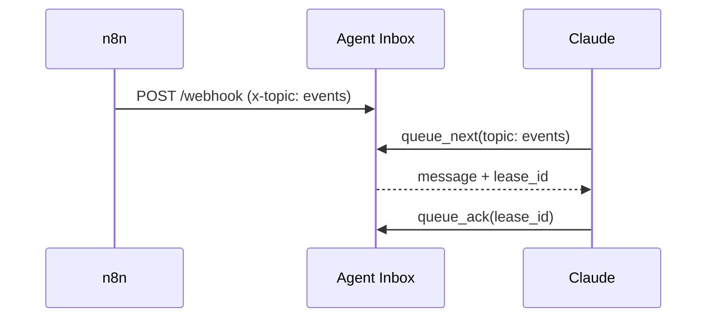
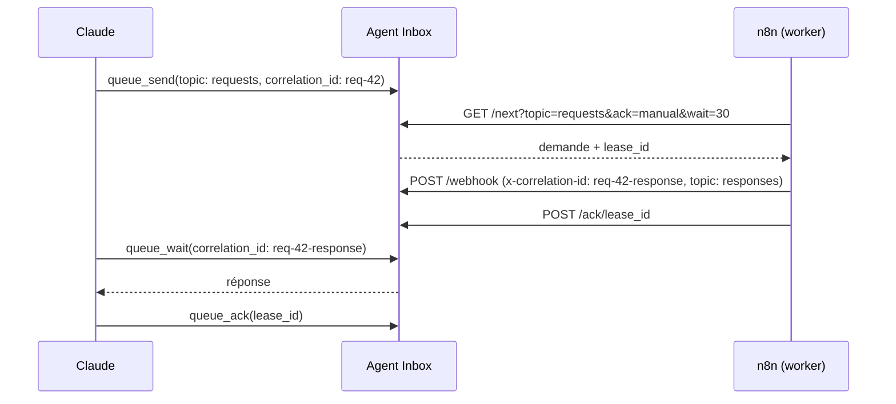

# Cas d'usage

Trois recettes, alignées sur les workflows de [`examples/n8n/`](../examples/n8n/README.md). Préparation
commune : connecter Claude ([guide](connecter-un-client.md)) et créer le credential n8n `Agent Inbox`
(voir le [README des templates](../examples/n8n/README.md#préparer-n8n-une-seule-fois)).

## 1. n8n pousse un événement, Claude l'analyse

**Quand** : une commande, un ticket, une alerte arrive dans n8n et vous voulez que Claude l'examine.



**n8n** : template `01-evenement-vers-claude.json`. Un nœud HTTP Request envoie le payload en
`POST /webhook` avec `x-topic: events`. Pour une file sans topic, retirez l'en-tête : les messages vont dans `default`.

**Claude** : demandez-lui, par exemple, « Regarde la file `events` et résume ce qui est arrivé » :

1. `queue_stats(topic: "events")` : combien de messages attendent ;
2. `queue_next(topic: "events")` : prend le plus ancien et renvoie son `lease_id` ;
3. analyse le payload ;
4. `queue_ack(lease_id)` : confirme le traitement. Sans cela, le message revient après `lease_timeout_sec`.

Pour inspecter sans consommer : `queue_peek` ou `queue_search(topic: "events", text: "order_id")`.

## 2. Requête-réponse par `correlation_id`

**Quand** : Claude confie un travail à n8n (appel d'une API, requête en base, génération d'un document) et
attend le résultat.



Un `correlation_id` est **unique dans toute la file** : la réponse ne peut pas reprendre celui de la
demande (`409 duplicate_correlation_id`). La convention du template est `<identifiant de la demande>-response`.

**Claude** envoie la demande, puis attend la réponse :

```text
queue_send(topic: "requests", correlation_id: "req-42", payload: { "action": "generate_report", "month": "2026-09" })
queue_wait(correlation_id: "req-42-response", timeout_sec: 30)
queue_ack(lease_id)
```

`queue_wait` attend jusqu'à 50 secondes ; s'il renvoie `empty: true`, rappelez-le : ce n'est pas une
erreur. Pour lire la réponse sans la consommer, utilisez `queue_by_id(correlation_id: "req-42-response")`
(`peek: true` par défaut).

**n8n** : template `02-request-response.json`. Le worker :

1. `GET /next?topic=requests&ack=manual&wait=30` : prend une demande (attente longue) ;
2. traite le payload (nœud Code à remplacer par votre logique) ;
3. `POST /webhook` avec `x-topic: responses` et `x-correlation-id: <demande>-response` ;
4. `POST /ack/<lease_id>` : acquitte la demande, puis reprend en 1 tant qu'il y en a.

Si n8n plante entre 3 et 4, le bail expire et la demande revient : prévoyez un traitement idempotent.

## 3. Digest quotidien de plusieurs sources

**Quand** : vous voulez qu'une seule synthèse vous attende chaque matin, au lieu de dix notifications.

**n8n** : template `03-digest-quotidien.json`. Un Schedule Trigger (8 h) interroge plusieurs sources, un
nœud Code les assemble en un seul objet, et un `POST /webhook` le dépose sur le topic `digest` avec
`x-correlation-id: digest-AAAA-MM-JJ` (un seul digest par jour, un doublon est refusé en `409`).

**Claude** : « Donne-moi le digest du jour ».

```text
queue_by_id(correlation_id: "digest-2026-10-01")     # consulte sans consommer
queue_next(topic: "digest") puis queue_ack(lease_id)  # ou : le prend et le marque traité
```

Les digests s'accumulent : donnez-leur une rétention propre avec le réglage `topic_ttl_overrides`
(Admin → Réglages), par exemple `{"digest": 168}` pour sept jours, sans toucher aux autres topics.
`queue_search(topic: "digest", since: "2026-09-24T00:00:00Z")` retrouve ceux de la semaine.
