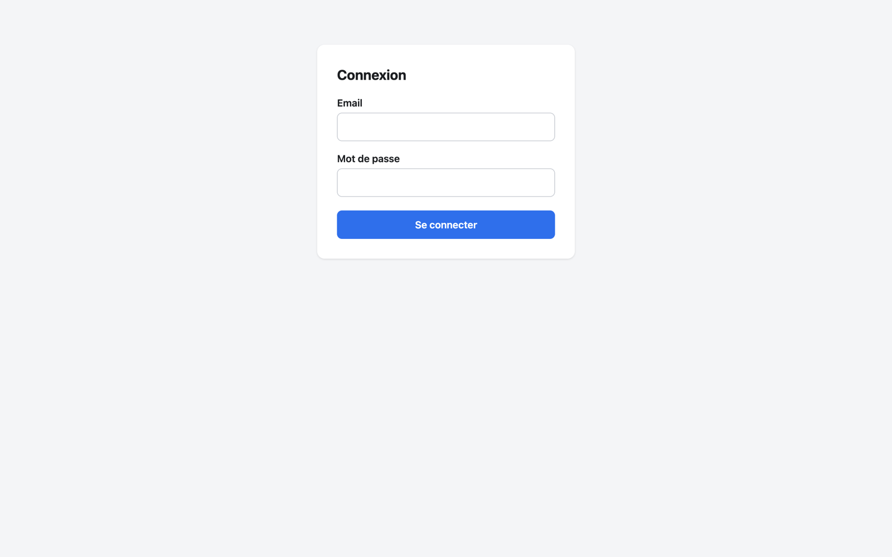

# Connecter un client

L'adresse MCP de votre instance est `<PUBLIC_URL>mcp`, par exemple `https://queue.example.com/mcp`
(Admin → Connexions l'affiche). Elle doit être en HTTPS et se terminer par `/mcp`.

Deux modes d'authentification, au choix du client :

| Mode | Pour qui | Fonctionnement |
|---|---|---|
| **OAuth 2.1** | Claude, ChatGPT, tout client qui sait ouvrir un navigateur | Le client s'enregistre seul, vous vous connectez avec votre compte administrateur, puis vous autorisez l'accès sur une page de consentement. |
| **Clé API** `aik_…` | Scripts, agents, CI, clients sans OAuth | En-tête `Authorization: Bearer aik_…`. Créée dans Admin → Connexions ; affichée une seule fois, révocable. |

## Claude (Web, Desktop)

1. Ouvrez **Paramètres → Connecteurs → Ajouter un connecteur personnalisé**.
2. Nom : `Agent Inbox`. URL : `https://queue.example.com/mcp`. Validez.
3. Claude ouvre la page de connexion de votre instance : saisissez l'e-mail et le mot de passe du compte
   administrateur.
4. Sur la page de consentement, vérifiez le nom du client et l'hôte de redirection, puis **Autoriser**.




Le connecteur liste alors les 12 outils. Il continue de fonctionner après un redémarrage du conteneur :
le serveur MCP ne garde aucune session en mémoire. Un jeton d'accès dure 1 heure et se renouvelle seul
(refresh token : 30 jours).

## Claude Code

```bash
claude mcp add --transport http agent-inbox https://queue.example.com/mcp
```

Puis, dans Claude Code, tapez `/mcp`, choisissez `agent-inbox` et **Authenticate** : le navigateur s'ouvre
sur la page de connexion, puis de consentement.

Variante avec une clé API (sans navigateur) :

```bash
claude mcp add --transport http agent-inbox https://queue.example.com/mcp \
  --header "Authorization: Bearer aik_…"
```

## ChatGPT

ChatGPT accepte les serveurs MCP distants comme connecteurs personnalisés, en **mode développeur** :
activez-le dans les réglages (section Connecteurs, paramètres avancés ; l'intitulé exact varie selon la
version), créez un connecteur, collez `https://queue.example.com/mcp` et choisissez l'authentification
**OAuth**. Le déroulé est le même que pour Claude : connexion, puis consentement.

## Autres clients (clé API)

Tout client MCP compatible avec le transport HTTP « streamable » et un en-tête personnalisé convient.
Dans Admin → Connexions, créez une clé (donnez-lui un nom qui identifie son usage), copiez-la, puis
configurez le client. La forme courante est :

```json
{
  "mcpServers": {
    "agent-inbox": {
      "type": "http",
      "url": "https://queue.example.com/mcp",
      "headers": { "Authorization": "Bearer aik_…" }
    }
  }
}
```


## Vérifier sans client

```bash
# Sans authentification : 401 et un en-tête WWW-Authenticate (découverte OAuth)
curl -i -X POST https://queue.example.com/mcp

# Avec une clé API : la liste des 12 outils
curl -sS -X POST https://queue.example.com/mcp \
  -H "Authorization: Bearer aik_…" \
  -H "Content-Type: application/json" -H "Accept: application/json, text/event-stream" \
  -d '{"jsonrpc":"2.0","id":1,"method":"tools/list"}'
```

## Gérer les accès

Admin → Connexions liste les clés API (préfixe, dernière utilisation) et les clients OAuth enregistrés
(nombre de jetons actifs). Révoquer une clé ou supprimer un client coupe l'accès immédiatement pour les
clés ; pour un client OAuth, ses codes et jetons sont supprimés avec lui. Le nettoyage périodique
supprime aussi les clients OAuth enregistrés depuis plus de 30 jours qui n'ont plus aucun jeton actif
(il faut alors supprimer puis réajouter le connecteur côté client). Changer le mot de passe administrateur
révoque tous les jetons OAuth : les connecteurs doivent se reconnecter ; les clés API restent valides.

Le connecteur ne s'affiche pas ou n'a aucun outil ? Voir le [dépannage](installation.md#dépannage).
